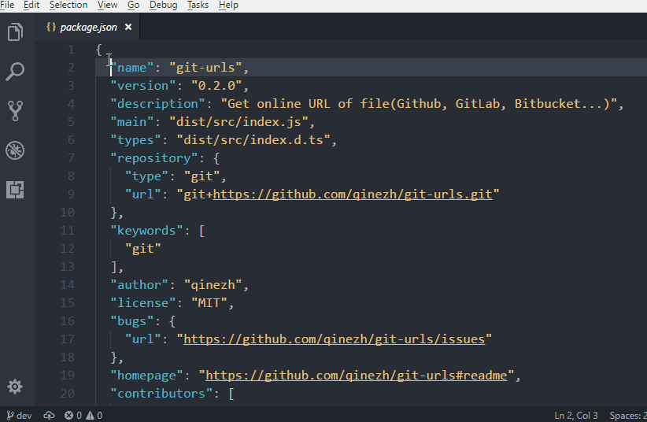

# vscode-gitlink

Inspired by GitHub extension for Visual Studio, this extension provide the feature that **Go To** current file's online link in browser and **Copy** the link in clipboard.

## Features

1. Go to the online link of current file.
2. Copy the online link of current file.

Note: Only support files in GitHub/GitLab at the moment.

## Install
Press `F1`, type `ext install gitlink`

## Usage

## Release Notes

### 0.0.1

Initial release of vscode-git-link

**Enjoy!**